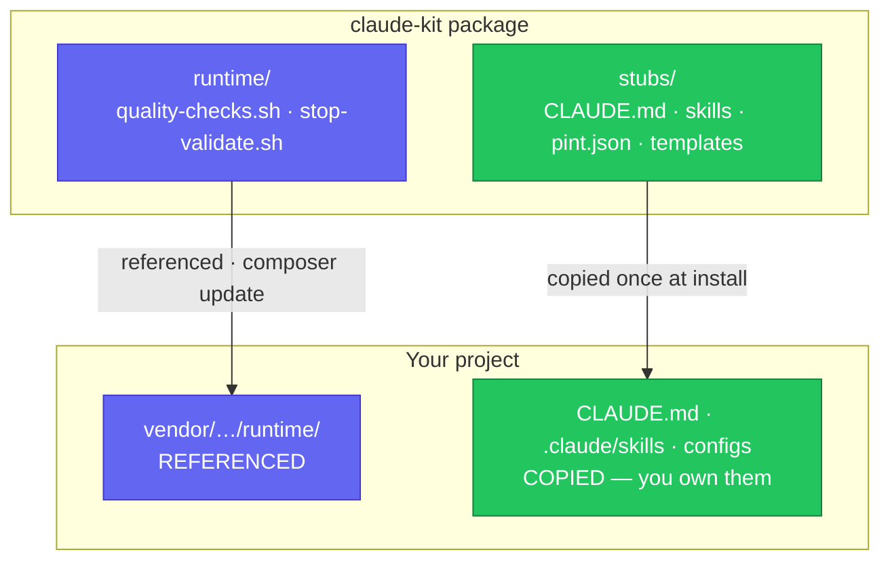
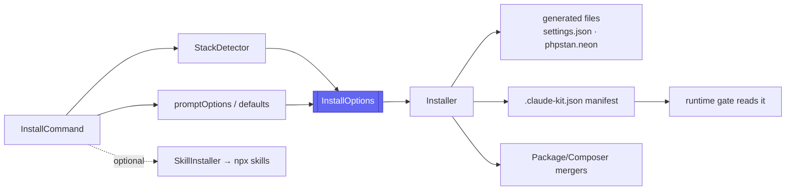

# 🏗️ Architecture

claude-kit is a small, focused Composer package. This page explains how it is built so contributors change the right thing in the right place.

## The hybrid model

Everything the package ships falls into one of two buckets:



- **`runtime/` is referenced.** Host projects call it in place at `vendor/…/runtime/`, so a `composer update` propagates fixes to every consumer. Treat it as a public API.
- **`stubs/` is published.** Copied into the host once; consumers own their copy. Updates reach them only via `install --force`.

> The rule: **machinery** goes in `runtime/`, **content/opinion** goes in `stubs/`.

## How a run flows



## Components

```
src/
  ClaudeKitServiceProvider.php   Registers the command (package discovery)
  Commands/InstallCommand.php    Thin: resolve stack + prompt → InstallOptions → Installer
  Support/
    FrontendStack.php            Enum — the ONE place per-stack differences live
    TestTool.php                 Enum — Pest | PHPUnit
    InstallOptions.php           Readonly DTO — every resolved choice + defaults()
    StackDetector.php            composer.json + package.json → FrontendStack
    Installer.php                Pure filesystem scaffolder (no shell-outs)
    SkillInstaller.php           Wraps npx skills find/add (skills.sh)
    PackageJsonMerger.php        Idempotent, non-destructive package.json merge
    ComposerJsonMerger.php       Idempotent, non-destructive composer.json merge
```

- **`InstallCommand`** does no file work — it resolves inputs and delegates. Thin and testable.
- **`Installer`** is pure I/O: generates `.claude/settings.json`, `phpstan.neon`, and the `.claude-kit.json` manifest; copies stubs (skip unless `--force`); routes JSON changes through the mergers; returns a created/overwritten/skipped report.
- **`FrontendStack`** centralises per-stack skills, npm scripts, devDependencies, stub directory, and CLAUDE.md prose. Add a stack here + a `stubs/frontend/<dir>/`.

## Testing

- **Unit** tests exercise `StackDetector`, the mergers, `TestTool`, and `Installer` against temp directories (`temp_project()` / `stubs_path()` helpers in `tests/Pest.php`).
- **Feature** tests drive `claude-kit:install` through Testbench — including a full interactive walkthrough — and fake `npx` via `Process::fake()`.
- Coverage is enforced at **80%+** in CI.

## Dogfooding

The repo runs its own gate (`bin/quality-checks.sh`) via the committed `.githooks/pre-commit`, including a **changelog rule** — the same philosophy it ships. (A local Claude Stop hook may live in a gitignored `.claude/`.)

---
<sub>[← Skills](Skills) · 🏠 [Home](Home) · [Publishing →](Publishing)</sub>
