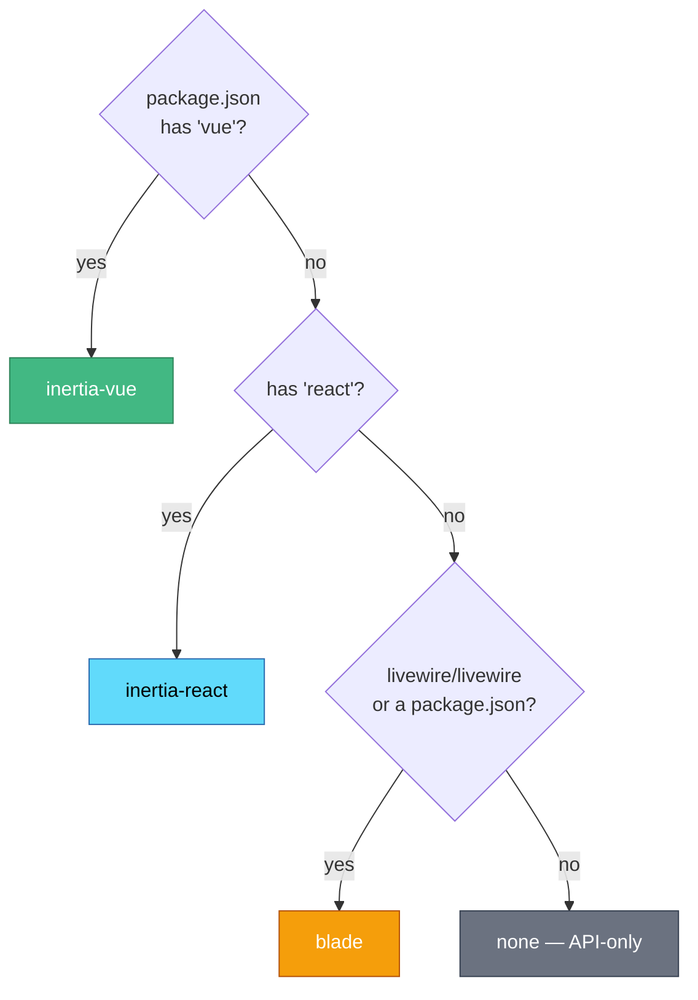

# 🎨 Frontend stacks

claude-kit tailors the frontend tooling, npm dependencies, scripts, and skills to your project's stack. It detects the stack, and you confirm or override it.

## How detection works

Override anytime with `--stack=inertia-vue|inertia-react|blade|none`.

## What each stack installs

| Stack | Config files | npm scripts | Type check | Extra skills |
| --- | --- | --- | --- | --- |
| **inertia-vue** | `eslint.config.js`, `.prettierrc`, `tsconfig.json` | lint, format, types | `vue-tsc --noEmit` | inertia-vue-development, tailwindcss-development, wayfinder-development |
| **inertia-react** | `eslint.config.js`, `.prettierrc`, `tsconfig.json` | lint, format, types | `tsc --noEmit` | tailwindcss-development |
| **blade** | `.prettierrc` | format | — | tailwindcss-development |
| **none** | *(none)* | *(none)* | — | *(none)* |

> Base skills installed for **every** stack: `laravel-best-practices`, `pest-testing`.

## The gate is stack-aware

`quality-checks.sh` runs the frontend block **only if** your `package.json` defines the matching scripts. So one gate is correct whether you have a full Vue/React toolchain, Prettier-only Blade formatting, or no frontend at all.

## Adding a stack

Stacks are defined in one place: the `FrontendStack` enum (`src/Support/FrontendStack.php`) plus a `stubs/frontend/<dir>/` directory. See **[Architecture](Architecture)** and [CONTRIBUTING](https://github.com/mohamed-ashraf-elsaed/claude-kit/blob/main/CONTRIBUTING.md).

---
[← Configuration](Configuration) · 🏠 [Home](Home) · [Quality gate →](Quality-Gate)
