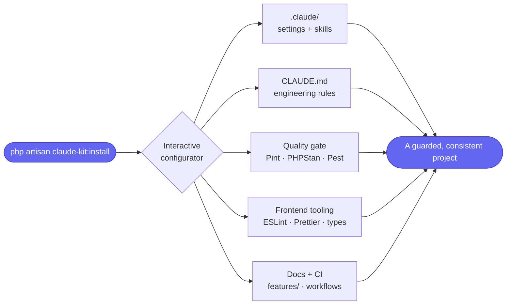

# claude-kit

> **One command sets up any Laravel project for [Claude Code](https://claude.com/claude-code)** — engineering rules, a Stop-hook + pre-commit quality gate, skills, PHPStan/Pint/Pest, feature-doc scaffolding, and stack-aware frontend tooling.

```bash
composer require --dev mohamed-ashraf-elsaed/claude-kit
php artisan claude-kit:install
```

---

## What you get, at a glance



## Guides

| Page | What it covers |
| --- | --- |
| 📥 **[Installation](Installation)** | Install and run it for the first time |
| ⚙️ **[Usage](Usage)** | The interactive flow, flags, and re-running |
| 🔧 **[Configuration](Configuration)** | Env toggles, the `.claude-kit.json` manifest, customising |
| 🎨 **[Frontend stacks](Frontend-Stacks)** | Vue / React / Blade / API-only detection |
| ✅ **[Quality gate](Quality-Gate)** | Pint, PHPStan, Pest, and the three hooks |
| 🧠 **[Skills](Skills)** | Bundled skills + finding more via skills.sh |
| 🏗️ **[Architecture](Architecture)** | How the package is built (the hybrid model) |
| 🚀 **[Publishing](Publishing)** | Releasing and Packagist |
| ⬆️ **[Upgrading](Upgrading)** | Moving between versions |
| ❓ **[FAQ](FAQ)** | Common questions |

## Three ideas in one minute

- **Hybrid updates.** Machinery lives in `vendor/…/runtime/` and auto-updates via `composer update`; content (rules, skills, configs) is copied into your repo so you own it.
- **One gate, everywhere.** The pre-commit hook, Claude's Stop hook, and CI all run the same `quality-checks.sh`.
- **You choose everything.** The installer asks what you want — Pint? PHPStan level? test runner? which hooks and skills? — nothing is forced.

> [!TIP]
> New here? Start with **[Installation](Installation)**, then skim **[Usage](Usage)** to see the prompts you'll answer.

---
<sub>🏠 **Home** · [Installation →](Installation)</sub>
