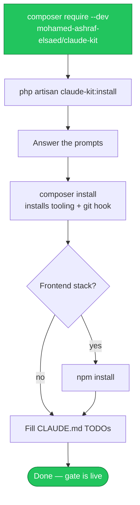

# 📥 Installation

Get claude-kit into a Laravel project and run it for the first time.

## Requirements

| | |
| --- | --- |
| **PHP** | 8.2+ |
| **Laravel** | 11, 12, or 13 |
| **Claude Code** | to use the rules, hooks, and skills |
| **Node.js** | only if you want a frontend stack or the skills.sh finder |
| **pcov / Xdebug** | optional, to enforce the coverage gate |

## The happy path



```bash
composer require --dev mohamed-ashraf-elsaed/claude-kit
php artisan claude-kit:install
composer install   # installs the selected tooling and wires the pre-commit hook
npm install        # only if a frontend stack was set up
```

## From GitHub (before Packagist, or for a fork)

<details>
<summary>Show the VCS repository setup</summary>

Add a repository entry to your project's `composer.json`, then require the branch:

```json
{
    "repositories": [
        { "type": "vcs", "url": "https://github.com/mohamed-ashraf-elsaed/claude-kit" }
    ]
}
```

```bash
composer require --dev mohamed-ashraf-elsaed/claude-kit:dev-main
php artisan claude-kit:install
```
</details>

## What happens during install

1. Detects your **frontend stack** and asks you to confirm it.
2. Walks you through **every choice** (see **[Usage](Usage)**).
3. Writes the files, **skipping any that already exist** (use `--force` to overwrite) and **merging** `composer.json` / `package.json`.
4. Wires the git hooks path if the project is a git repo.

## Verify it works

```bash
# Run the gate manually
vendor/mohamed-ashraf-elsaed/claude-kit/runtime/quality-checks.sh
```

Open Claude Code in the project, make a small change, and confirm the **Stop hook** runs the gate.

> [!TIP]
> The coverage gate needs a driver. On Debian/Ubuntu: `sudo apt install -y php8.4-pcov`. Without one, tests still run and coverage is only **warned**.

## Post-install checklist

- [ ] `composer install` completed
- [ ] `npm install` (if a frontend stack was chosen)
- [ ] Filled the `TODO` placeholders in `CLAUDE.md`
- [ ] Coverage driver installed (optional)

---
<sub>[← Home](Home) · 🏠 [Home](Home) · [Usage →](Usage)</sub>
