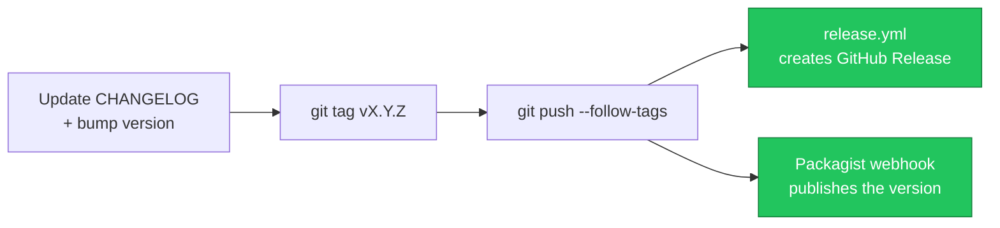

# 🚀 Publishing to Packagist

`claude-kit` is a normal Composer package. Publishing makes `composer require --dev mohamed-ashraf-elsaed/claude-kit` work for everyone.

## The release pipeline



## One-time setup

1. Push the repo to GitHub (public).
2. Go to <https://packagist.org> → **Submit**, paste `https://github.com/mohamed-ashraf-elsaed/claude-kit`. Packagist reads `composer.json` and registers the package.
3. **Enable auto-updates** — install the [Packagist GitHub app](https://github.com/apps/packagist) on the repo (recommended), or add the Packagist webhook manually.

## Cutting a version

Follow [RELEASING.md](https://github.com/mohamed-ashraf-elsaed/claude-kit/blob/main/RELEASING.md): update the changelog, tag `vX.Y.Z`, push the tag. Packagist picks it up in seconds and `release.yml` creates the GitHub Release.

```bash
git tag -a vX.Y.Z -m "vX.Y.Z"
git push origin main --follow-tags
```

## Versions on Packagist

- Tagged commits (`vX.Y.Z`) become stable releases.
- The default branch is available as `dev-main` for early adopters.
- Consumers pin normally, e.g. `"mohamed-ashraf-elsaed/claude-kit": "^0.2"`.

## Pre-publish checklist

- [ ] `composer validate --strict` passes
- [ ] `composer check` is green (Pint, PHPStan, Pest)
- [ ] `CHANGELOG.md` has a dated section for the version
- [ ] `vX.Y.Z` tag pushed
- [ ] Repo is public and the Packagist app/webhook is connected

---
<sub>[← Architecture](Architecture) · 🏠 [Home](Home) · [Upgrading →](Upgrading)</sub>
