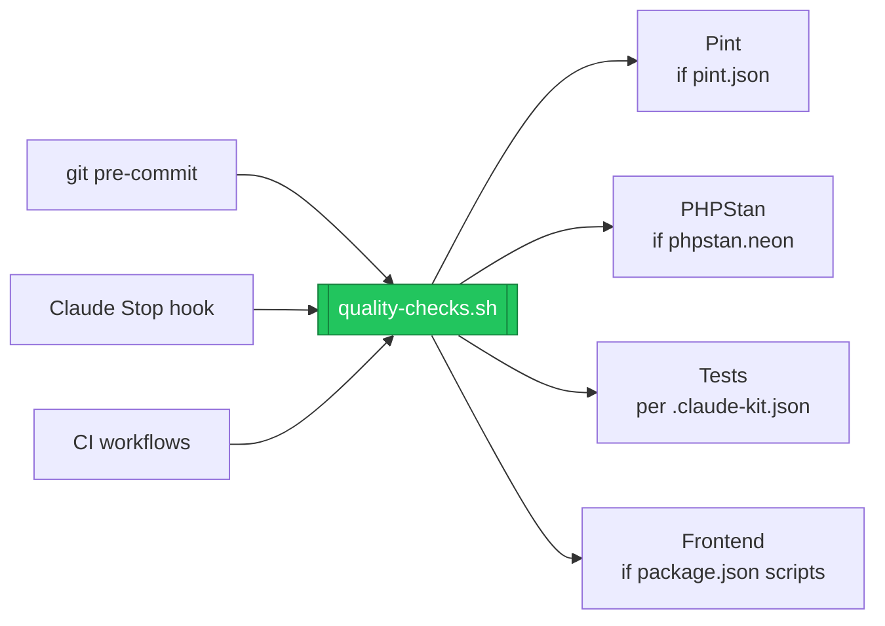

# ✅ The quality gate

One script — `vendor/mohamed-ashraf-elsaed/claude-kit/runtime/quality-checks.sh` — is the single source of truth, invoked in three places so the bar is identical everywhere.



## What it runs

**PHP — based on what you installed:**

- **Pint** (`--test`) — runs when `pint.json` exists.
- **PHPStan** — runs when `phpstan.neon` exists; the level and strict-rules are whatever you chose (they live in that file). Must be **zero** errors.
- **Tests** — per `.claude-kit.json`: the chosen runner and, for Pest, `--coverage --min=<threshold>` when a coverage driver is present (otherwise the suite runs and coverage is **warned**, not enforced).

**Frontend — only if `package.json` defines the scripts:**

- `lint:check` (ESLint) · `format:check` (Prettier) · `types:check` (`vue-tsc` / `tsc`).

## The three enforcement points

| Where | File | Blocks |
| --- | --- | --- |
| Commit time | `.githooks/pre-commit` | a bad `git commit` |
| Claude turn | `.claude/settings.json` → Stop hook | Claude from finishing a turn |
| CI | `.github/workflows/*` | a bad merge |

## The Stop hook's feature-doc gate

Beyond the quality suite, the Stop hook requires that any change under `app/`, `database/`, `routes/`, or `resources/js/` is accompanied by an added/updated doc under `features/<name>/` (copy `features/_TEMPLATE/`). This keeps docs in lockstep with code.

> [!TIP]
> Disable it with `CLAUDE_KIT_FEATURE_DOCS=0`, or by setting `hooks.feature_docs` to `false` in `.claude-kit.json`.

## Coverage driver

```bash
sudo apt install -y php8.4-pcov   # example: PHP 8.4 on Debian/Ubuntu
```

Without `pcov`/Xdebug, the gate runs the tests and prints a warning instead of failing on coverage.

## Bypassing (when you must)

- Commits: `git commit --no-verify`
- Coverage threshold: `CLAUDE_KIT_MIN_COVERAGE` (not recommended)

> [!WARNING]
> These are escape hatches, not defaults — CI still enforces the full gate.

---
<sub>[← Frontend stacks](Frontend-Stacks) · 🏠 [Home](Home) · [Skills →](Skills)</sub>
