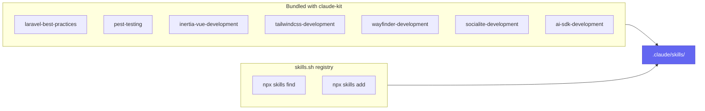

# 🧠 Skills

claude-kit publishes a curated set of [Claude Code skills](https://docs.claude.com/en/docs/claude-code) into `.claude/skills/`. Claude activates them automatically based on the work at hand (or you invoke one with `/<skill-name>`).



## What ships

**Installed for every stack:**

- **laravel-best-practices** — Laravel patterns: queries, security, validation, caching, queues, migrations, and more (one rule file per topic under `rules/`).
- **pest-testing** — writing and fixing Pest tests (feature/unit/browser, datasets, mocking, architecture tests).

**Installed per stack** (see **[Frontend stacks](Frontend-Stacks)**):

- **inertia-vue-development**, **wayfinder-development**, **tailwindcss-development**.

**Available to select:** **socialite-development**, **ai-sdk-development**.

## Finding more skills (skills.sh)

During install, after picking the bundled skills, you can search the [skills.sh](https://www.skills.sh) registry and install without leaving the prompt. Under the hood claude-kit shells out to the Skills CLI:

```bash
npx skills find <query>      # search the registry
npx skills add <package>     # install into .claude/skills
```

> [!NOTE]
> This requires `npx` (Node.js). If it's not available, the step is skipped with a notice — the bundled skills still install.

## Customising

Everything under `.claude/skills/` is a plain Markdown bundle you own. Edit them, delete the ones you don't want, or add your own project skills alongside them.

## Refreshing after an update

Skills are *copied* (not referenced), so `composer update` does not change them. Pull the latest shipped versions by re-running the installer and overwriting:

```bash
php artisan claude-kit:install --force
```

---
<sub>[← Quality gate](Quality-Gate) · 🏠 [Home](Home) · [Architecture →](Architecture)</sub>
