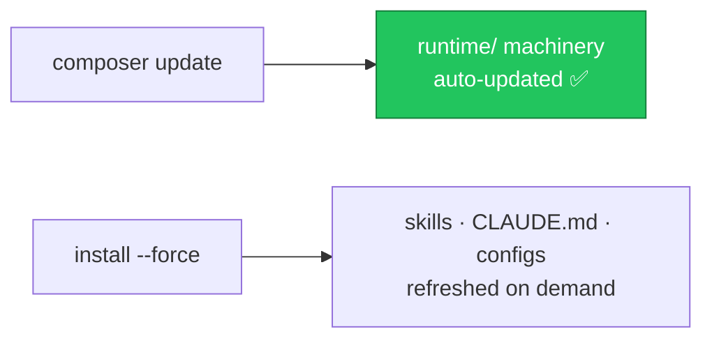

# ⬆️ Upgrading

## Update the package

```bash
composer update mohamed-ashraf-elsaed/claude-kit
```

This immediately updates the **referenced machinery** under `vendor/…/runtime/` (the quality gate and Stop hook) — no other action needed.

## Refresh the copied content

The **published** files (skills, `CLAUDE.md`, linter configs, templates) were copied into your repo, so `composer update` does not touch them. To pull the latest shipped versions, re-run the installer and overwrite:

```bash
php artisan claude-kit:install --force
```

> [!WARNING]
> `--force` overwrites those files. Review the diff and re-apply any local customisations you had made.

## What updates how



## Reading the changelog

Every release documents what changed in [CHANGELOG.md](https://github.com/mohamed-ashraf-elsaed/claude-kit/blob/main/CHANGELOG.md). While the package is `0.x`, minor versions may include breaking changes — check the changelog before updating.

## Versioning

The package follows [SemVer](https://semver.org). Pin a constraint that matches your tolerance for change, e.g. `"^0.2"` (allows `0.2.*` and up within `0.x`) or a stricter `"0.2.*"`.

---
<sub>[← Publishing](Publishing) · 🏠 [Home](Home) · [FAQ →](FAQ)</sub>
