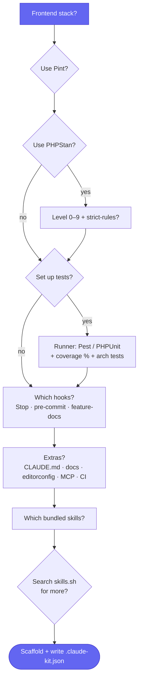

# ⚙️ Usage

`claude-kit:install` is a **fully interactive configurator** — it asks what you want instead of assuming.

## The command

```bash
php artisan claude-kit:install [--stack=] [--force] [--no-interaction]
```

| Option | Description |
| --- | --- |
| `--stack=` | `inertia-vue`, `inertia-react`, `blade`, or `none`. Auto-detected when omitted. |
| `--force` | Overwrite files that already exist (otherwise they are skipped). |
| `--no-interaction` | Skip the prompts and accept sensible defaults (great for CI). |

## The interactive flow



Step by step, the installer asks:

1. **Frontend stack** — detected and confirmed (Vue / React / Blade / API-only).
2. **Code style** — use Pint?
3. **Static analysis** — use PHPStan? → **level (0–9)** → **strict-rules**?
4. **Tests** — set up a gate? → **runner** (Pest / PHPUnit) → **coverage minimum** (a number, or blank to skip) → **architecture tests**? (Pest only)
5. **Hooks** — which enforce the gate: Claude Stop hook · git pre-commit hook · feature-doc requirement.
6. **Extras** — CLAUDE.md rules · feature-doc templates · `.editorconfig` + `.gitattributes` · Laravel Boost MCP · GitHub Actions.
7. **Skills** — pick bundled skills, then optionally search **[skills.sh](https://www.skills.sh)** for more.

Your answers are written to `.claude-kit.json`, which the gate reads. See **[Configuration](Configuration)**.

## Defaults (`--no-interaction`)

> Pint on · PHPStan level 7 + strict-rules · Pest with an 80% coverage gate and architecture tests · all three hooks · the stack's default skills · all extras.

## Re-running & idempotency

Re-running is safe:

- Existing files are **skipped** unless you pass `--force`.
- `composer.json` and `package.json` are **merged** — your entries are never overwritten.
- Running twice changes nothing.

## After install

- [ ] `composer install` — installs the selected tooling and (if chosen) wires the pre-commit hook
- [ ] `npm install` — if a frontend stack was set up
- [ ] Fill the `TODO` placeholders in `CLAUDE.md`

---
<sub>[← Installation](Installation) · 🏠 [Home](Home) · [Configuration →](Configuration)</sub>
